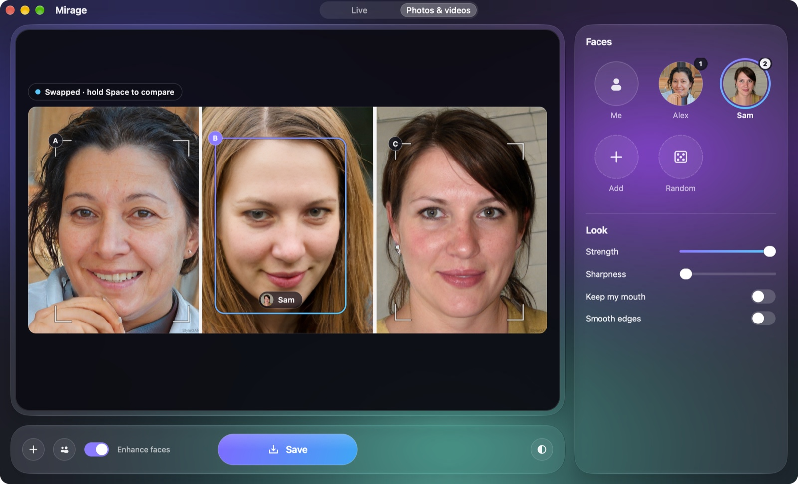
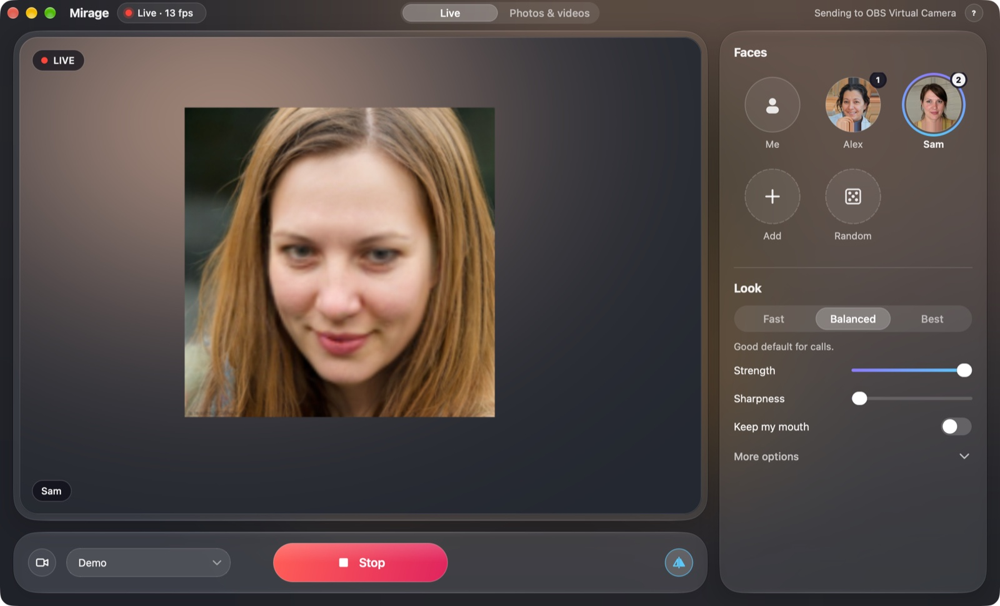

<p align="right"><b>English</b> · <a href="README.ru.md">Русский</a></p>

<h1 align="center">Mirage</h1>

<p align="center">
  <b>Wear someone else's face on a Zoom call, or swap faces in your photos and videos.</b><br>
  A just-for-fun face swap app for Macs with Apple Silicon.
</p>

<p align="center">
  
  
  
  
</p>

<p align="center">
  
</p>

## What it is

A toy we made for fun: pick a photo of a face, press **Start**, and in Zoom,
Meet or FaceTime you show up with that face, live. Press `1`–`9` to switch
faces mid-call, `0` to be yourself again. It also swaps faces in photos and
videos you already have. Everything runs on your Mac; nothing is uploaded.

It is a native-looking macOS app (Liquid Glass, English and Russian) built on
the open-source [Deep-Live-Cam](https://github.com/hacksider/Deep-Live-Cam)
engine by hacksider and contributors.

> [!IMPORTANT]
> Only use someone's face if they're fine with it, and tell people it's a
> joke. The face models are licensed for non-commercial use only, so Mirage is
> too. The rules fit on one page: [Responsible use](docs/RESPONSIBLE_USE.md).

## What it can do

- **Live in calls.** Your camera with a different face, sent to **OBS Virtual
  Camera** at a steady 1280×720 that Zoom, Meet or FaceTime can pick. About
  14 fps on a MacBook Air M1.
- **A face library.** Drop in photos (HEIC works), or press 🎲 for a face
  of someone who doesn't exist. Switch with a click or `1`–`9`.
- **Photos.** Mirage finds every face, picks who to swap (you, or the main
  face), lets you change it with a click, and saves `name-mirage.jpg` next to
  the original. The original is never touched.
- **Batches and videos.** A whole folder of photos in one go. Videos keep
  their sound, and the right face stays on the right person through the whole
  clip.
- **Look.** Quality presets, swap strength, sharpness, *Keep my mouth* (your
  real mouth, so talking looks natural), face enhancement.

<p align="center">
  
</p>

## What it runs on

| Part | What's used |
|---|---|
| App | Python 3.14, [Qt for Python](https://doc.qt.io/qtforpython-6/) (PySide6), native macOS glass through [PyObjC](https://github.com/ronaldoussoren/pyobjc) |
| Face swap | [Deep-Live-Cam](https://github.com/hacksider/Deep-Live-Cam) engine: [InsightFace](https://github.com/deepinsight/insightface) face detection and recognition, the `inswapper_128` swap model |
| Speed | [ONNX Runtime](https://onnxruntime.ai) with CoreML: the swap runs on the Apple Neural Engine, face detection on the GPU, side by side. Compiled models are cached, so launches after the first take a few seconds |
| Face enhancement | [GFPGAN](https://github.com/TencentARC/GFPGAN) for photos, [GPEN](https://github.com/yangxy/GPEN) for the *Best* preset and videos |
| Video | [FFmpeg](https://ffmpeg.org) with the Mac's hardware H.264 encoder |
| Calls | [OBS Studio](https://obsproject.com)'s virtual camera through [pyvirtualcam](https://github.com/letmaik/pyvirtualcam) |

## Requirements

| | |
|---|---|
| Mac | Apple Silicon (M1 or newer). Intel Macs are not supported. |
| macOS | 14 or newer. The Liquid Glass look needs macOS 26; older versions get a plain dark window. |
| Disk | About 6 GB free: Python packages (~2 GB), models (~2 GB), compiled-model cache (~1–2 GB). |
| Tools | [Homebrew](https://brew.sh) and the Xcode Command Line Tools (`xcode-select --install`). The installer gets the rest: Python 3.14, ffmpeg, the models, and OBS if you want it. |
| For calls | [OBS Studio](https://obsproject.com) (free). Only its virtual camera is used; nothing to set up in OBS. |

## Install

```bash
git clone https://github.com/RebSem/mirage
cd mirage
make install        # Python, packages, models, ffmpeg; offers OBS. Safe to re-run.
make install-app    # Mirage.app in ~/Applications, plus a shortcut in this folder
```

Then open **Mirage** from Launchpad, Spotlight or the project folder
(`make run` works too). On the first **Start**, click **Allow** for the
camera. If Zoom doesn't list *OBS Virtual Camera* yet, open OBS once and click
**Start Virtual Camera** to install it.

`Mirage.app` runs the code in the folder you cloned, so keep that folder
where it is (or run `make install-app` again after moving it).

## Use it

**In a call**

1. Pick a face on the right (or `0` to stay yourself for now).
2. Press **Start** (`Space`).
3. In Zoom: **Settings → Video → Camera → OBS Virtual Camera**. Same idea in
   Meet and other apps.
4. Switch faces with `1`–`9` during the call, `0` for your own face.

**Photos and videos**

1. Switch to **Photos & videos** at the top and drop in a photo, a folder or a
   video (or `⌘⇧O`).
2. Check who gets swapped: faces are marked A, B, C; click one to choose who
   it becomes.
3. Press the big button: **Swap** → **Save** (`⌘S`), or **Make video**. Hold
   `Space` to compare with the original.

| Key | Action |
|---|---|
| `Space` | Start / Stop (in Photos & videos: hold to see the original) |
| `1`–`9`, `0` | Switch face, your own face |
| `⌘O` / `⌘⇧O` | Add face photos / open photos or a video |
| `⌘S` | Save the swapped photo |
| `⌘R` | Random face |
| `⌘Q` | Quit (stops the camera and any job, deletes an unfinished video) |

## Your data

Camera, photos and videos are processed on your Mac and never leave it. The
network is used only to download models and, when you press 🎲, one generated
face from thispersondoesnotexist.com.

| What | Where |
|---|---|
| Faces and settings | `~/Library/Application Support/Mirage` |
| Swapped photos and videos | next to the originals (`name-mirage.jpg`, `name-mirage.mp4`) |
| Compiled-model cache (safe to delete) | `~/Library/Caches/Mirage` |
| Logs | `~/Library/Logs/Mirage` |

## More

- [Troubleshooting](docs/TROUBLESHOOTING.md): camera access, OBS Virtual Camera, low fps, install errors
- [Photos & videos](docs/MEDIA.md): how Mirage picks faces, renders and saves
- [Architecture](docs/ARCHITECTURE.md) and [design](docs/DESIGN.md) notes
- [The engine](third_party/deep-live-cam/README.md): where Deep-Live-Cam comes from, what Mirage changed, how to update it; its classic window runs with `make classic`
- [Contributing](CONTRIBUTING.md), [changelog](CHANGELOG.md), [notice and third-party licenses](NOTICE.md)

## Credits and license

The face swap is the work of [Deep-Live-Cam](https://github.com/hacksider/Deep-Live-Cam)
by hacksider and [its contributors](https://github.com/hacksider/Deep-Live-Cam/graphs/contributors)
(based on [roop](https://github.com/s0md3v/roop)), with models by
[InsightFace](https://github.com/deepinsight/insightface), GFPGAN and GPEN.
Thank you.

Mirage is free software under the [GNU AGPL-3.0](LICENSE) and includes a
modified copy of the Deep-Live-Cam engine under the same license. The face
models have their own terms (InsightFace: non-commercial research use only);
see [NOTICE.md](NOTICE.md). Not affiliated with Apple, Zoom, Google, OBS or
the Deep-Live-Cam team.
