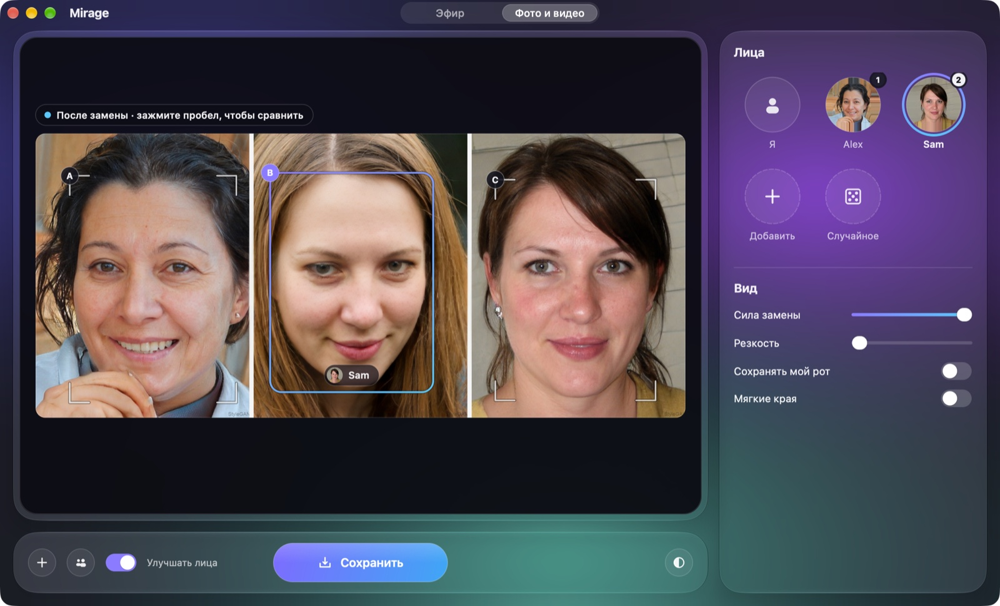
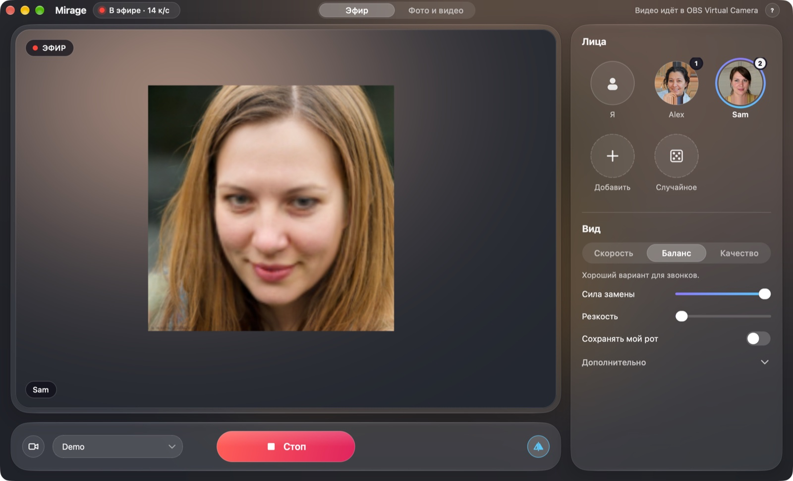

<p align="right"><a href="README.md">English</a> · <b>Русский</b></p>

<h1 align="center">Mirage</h1>

<p align="center">
  <b>Выйти в Zoom с чужим лицом или поменять лица на своих фото и видео.</b><br>
  Приложение для замены лиц на Mac с Apple Silicon — просто ради фана.
</p>

<p align="center">
  
  
  
  
</p>

<p align="center">
  
</p>

## Что это

Игрушка, которую мы сделали по приколу. Выбираете фото лица, жмёте
**«Старт»** — и в Zoom, Meet или FaceTime вы уже с этим лицом, вживую. `1`–`9`
переключают лица прямо во время звонка, `0` возвращает ваше. А ещё Mirage
меняет лица на готовых фото и видео. Всё считается на вашем Mac, в интернет
ничего не уходит.

Выглядит как родное приложение macOS (Liquid Glass, русский и английский
интерфейс), а замену лиц делает открытый движок
[Deep-Live-Cam](https://github.com/hacksider/Deep-Live-Cam) от hacksider и
участников проекта.

> [!IMPORTANT]
> Берите чужое лицо только с согласия человека и предупреждайте, что это
> шутка. Модели лиц разрешено использовать только некоммерчески — значит, и
> Mirage тоже. Правила занимают одну страницу:
> [Ответственное использование](docs/RESPONSIBLE_USE.md).

## Что умеет

- **Звонки вживую.** Картинка с камеры с другим лицом уходит в **OBS Virtual
  Camera** стабильно в 1280×720 — её выбирают в Zoom, Meet или FaceTime.
  Около 14 кадров в секунду на MacBook Air M1.
- **Библиотека лиц.** Перетащите фото (HEIC тоже подходит) или нажмите 🎲 —
  получите лицо несуществующего человека. Переключение кликом или `1`–`9`.
- **Фото.** Mirage находит все лица, сам решает, кого менять (вас или главное
  лицо), даёт поправить кликом и сохраняет `имя-mirage.jpg` рядом с
  оригиналом. Оригинал не трогается.
- **Пачки и видео.** Целая папка фото за раз. В видео сохраняется звук, а
  нужное лицо остаётся на нужном человеке до конца ролика.
- **Внешний вид.** Пресеты качества, сила замены, резкость, «Сохранять мой
  рот» (ваш настоящий рот — речь выглядит естественно), улучшение лиц.

<p align="center">
  
</p>

## На чём работает

| Часть | Что используется |
|---|---|
| Приложение | Python 3.14, [Qt for Python](https://doc.qt.io/qtforpython-6/) (PySide6), родное стекло macOS через [PyObjC](https://github.com/ronaldoussoren/pyobjc) |
| Замена лиц | движок [Deep-Live-Cam](https://github.com/hacksider/Deep-Live-Cam): поиск и распознавание лиц [InsightFace](https://github.com/deepinsight/insightface), модель замены `inswapper_128` |
| Скорость | [ONNX Runtime](https://onnxruntime.ai) с CoreML: замена считается на Neural Engine, поиск лиц — на GPU, параллельно. Скомпилированные модели кешируются, поэтому все запуски после первого занимают несколько секунд |
| Улучшение лиц | [GFPGAN](https://github.com/TencentARC/GFPGAN) для фото, [GPEN](https://github.com/yangxy/GPEN) для пресета «Качество» и видео |
| Видео | [FFmpeg](https://ffmpeg.org) с аппаратным кодеком H.264 самого Mac |
| Звонки | виртуальная камера [OBS Studio](https://obsproject.com) через [pyvirtualcam](https://github.com/letmaik/pyvirtualcam) |

## Что нужно

| | |
|---|---|
| Mac | Apple Silicon (M1 и новее). Mac на Intel не поддерживаются. |
| macOS | 14 или новее. Эффект Liquid Glass — с macOS 26, на более старых окно просто тёмное. |
| Диск | Около 6 ГБ свободного места: Python-пакеты (~2 ГБ), модели (~2 ГБ), кеш скомпилированных моделей (~1–2 ГБ). |
| Инструменты | [Homebrew](https://brew.sh) и Xcode Command Line Tools (`xcode-select --install`). Остальное поставит установщик: Python 3.14, ffmpeg, модели и, по желанию, OBS. |
| Для звонков | [OBS Studio](https://obsproject.com) (бесплатно). Нужна только её виртуальная камера, в самой OBS ничего настраивать не надо. |

## Установка

```bash
git clone https://github.com/RebSem/mirage
cd mirage
make install        # Python, пакеты, модели, ffmpeg; предложит OBS. Можно запускать повторно.
make install-app    # Mirage.app в ~/Applications и ярлык в папке проекта
```

Дальше открывайте **Mirage** из Launchpad, Spotlight или папки проекта (или
`make run`). При первом **«Старте»** нажмите **«Разрешить»** для камеры. Если
в Zoom ещё нет *OBS Virtual Camera*, один раз откройте OBS и нажмите
**Start Virtual Camera** — она установится.

`Mirage.app` запускает код из папки, куда вы клонировали проект, так что не
переносите её (а если перенесли — снова выполните `make install-app`).

## Как пользоваться

**В звонке**

1. Выберите лицо справа (или `0`, чтобы пока остаться собой).
2. Нажмите **«Старт»** (`пробел`).
3. В Zoom: **Настройки → Видео → Камера → OBS Virtual Camera**. В Meet и
   других приложениях — так же.
4. Во время звонка переключайте лица клавишами `1`–`9`, `0` — ваше лицо.

**Фото и видео**

1. Вверху переключитесь на **«Фото и видео»** и перетащите фото, папку или
   видео (или `⌘⇧O`).
2. Проверьте, кого поменять: лица помечены буквами A, B, C, клик по лицу —
   выбрать, кем оно станет.
3. Большая кнопка ведёт дальше: **«Заменить»** → **«Сохранить»** (`⌘S`) или
   **«Сделать видео»**. Зажмите `пробел`, чтобы сравнить с оригиналом.

| Клавиша | Действие |
|---|---|
| `Пробел` | Старт / стоп (в «Фото и видео» — зажать, чтобы увидеть оригинал) |
| `1`–`9`, `0` | Переключить лицо, ваше лицо |
| `⌘O` / `⌘⇧O` | Добавить фото лиц / открыть фото или видео |
| `⌘S` | Сохранить фото после замены |
| `⌘R` | Случайное лицо |
| `⌘Q` | Выйти (останавливает камеру и обработку, удаляет недоделанное видео) |

## Ваши данные

Камера, фото и видео обрабатываются на вашем Mac и никуда не уходят. Сеть
нужна только чтобы скачать модели и, если нажать 🎲, одно сгенерированное
лицо с thispersondoesnotexist.com.

| Что | Где |
|---|---|
| Лица и настройки | `~/Library/Application Support/Mirage` |
| Фото и видео после замены | рядом с оригиналами (`имя-mirage.jpg`, `имя-mirage.mp4`) |
| Кеш скомпилированных моделей (можно удалять) | `~/Library/Caches/Mirage` |
| Логи | `~/Library/Logs/Mirage` |

## Ещё

- [Если что-то не работает](docs/TROUBLESHOOTING.md): доступ к камере, OBS Virtual Camera, мало кадров, ошибки установки
- [Фото и видео](docs/MEDIA.md): как Mirage выбирает лица, заменяет и сохраняет
- Заметки об [архитектуре](docs/ARCHITECTURE.md) и [дизайне](docs/DESIGN.md)
- [Движок](third_party/deep-live-cam/README.md): откуда взят Deep-Live-Cam, что в нём изменено и как его обновлять; его классическое окно — `make classic`
- [Как помочь проекту](CONTRIBUTING.md), [история изменений](CHANGELOG.md), [лицензии сторонних компонентов](NOTICE.md)

Документация, кроме этого README, на английском.

## Благодарности и лицензия

Замену лиц сделали [Deep-Live-Cam](https://github.com/hacksider/Deep-Live-Cam)
от hacksider и [участников проекта](https://github.com/hacksider/Deep-Live-Cam/graphs/contributors)
(на основе [roop](https://github.com/s0md3v/roop)), модели —
[InsightFace](https://github.com/deepinsight/insightface), GFPGAN и GPEN.
Спасибо им.

Mirage — свободная программа под лицензией [GNU AGPL-3.0](LICENSE); в неё
входит изменённая копия движка Deep-Live-Cam под той же лицензией. У моделей
лиц свои условия (InsightFace — только для некоммерческих исследований),
подробнее в [NOTICE.md](NOTICE.md). Проект не связан с Apple, Zoom, Google,
OBS и командой Deep-Live-Cam.
