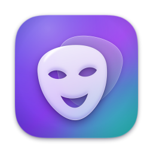

<p align="right"><a href="README.md">English</a> · <b>Русский</b></p>

<h1 align="center">Mirage</h1>

<p align="center">
  Другое лицо на видеозвонке. Вживую, на вашем Mac, просто ради забавы.
</p>

<p align="center">
  
  <!-- screenshot: docs/images/mirage-hero.png (added once captured) -->
</p>

Mirage — небольшое приложение для macOS, которое заменяет лицо в реальном
времени. Выбираете фото, жмёте **Старт** — и в Zoom или Meet вместо вас уже
друг (с его согласия) или сгенерированный незнакомец, а одна клавиша
возвращает ваше собственное лицо. А ещё Mirage умеет менять лица на уже
готовых фото и видео.

Это хобби-проект: более удобная, «родная» для macOS оболочка в стиле Apple
Liquid Glass поверх отличного открытого движка
[Deep-Live-Cam](https://github.com/hacksider/Deep-Live-Cam) от hacksider и
других участников. Вся тяжёлая работа (поиск лица, модель замены, улучшение
лица) — их заслуга. Mirage добавляет окно, библиотеку лиц, вывод в
виртуальную камеру и массу исправлений, чтобы всё работало стабильно.

> [!IMPORTANT]
> **Сначала согласие.** Берите чужое лицо, только если человек не против, и
> предупреждайте собеседников (и всех, кому показываете фото или видео с
> заменой), что это розыгрыш. Mirage — только для личного развлечения, не
> для заработка: модели лиц, на которых он работает, можно использовать
> только в некоммерческих целях. Пожалуйста, прочитайте
> [правила этичного использования](docs/RESPONSIBLE_USE.md) — они короткие
> (на английском).

## Что умеет

- **Одно окно в стиле Liquid Glass.** Живое превью и одна большая кнопка
  «Старт/Стоп». Превью, боковая панель и панель управления — на настоящем
  стекле macOS (`NSGlassEffectView`), в котором мягко преломляются цвета
  вашего же видео.
- **Библиотека лиц.** Перетащите фотографии на боковую панель (подойдут и
  снимки с iPhone в HEIC) — лица появятся большими круглыми миниатюрами.
  Нажмите на лицо или клавишу `1`–`9`, чтобы мгновенно переключиться:
  эмбеддинги лиц уже сохранены, так что заново ничего распознавать не нужно. `0` (плитка «Я»)
  возвращает ваше настоящее лицо, 🎲 даёт случайное сгенерированное.
- **Фото и видео тоже.** Переключитесь на **Фото и видео** вверху окна и
  перетащите в окно фото, целую папку или видео. Mirage найдёт лица, заменит
  ваше (или главное) лицо в полном разрешении и сохранит результат рядом с
  оригиналом. Подробнее — в разделе [«Фото и видео»](#фото-и-видео).
- **Простые настройки** в разделе «Вид». Режимы качества
  **Быстро / Баланс / Лучше** («Лучше» добавляет улучшение лица), «Сохранять
  мой рот» (в кадре остаётся ваш настоящий рот, и речь выглядит
  естественнее), ползунки «Смешивание» и «Резкость». В разделе **Ещё**:
  «Менять всех в кадре» (выбранное лицо получают все, кто в кадре), «Убрать
  синеву», «Мягкие края» и «Показывать FPS».
- **Сделано для звонков.** Картинка идёт прямо в **OBS Virtual Camera**,
  всегда в разрешении 1280×720, поэтому видео в Zoom не перезапускается,
  когда веб-камера переключается между форматами 4:3 и 16:9. Mirage работает
  и со свёрнутым окном, а пока вы в эфире, не даёт Mac уснуть.
- **Аккуратно запускается и закрывается.** Одновременно работает только одна
  копия (повторный запуск просто выводит её окно на передний план). При
  выходе камера всегда освобождается, а все потоки останавливаются — даже
  посреди звонка.
- **Настоящее приложение.** `Mirage.app` со своей иконкой, интерфейс на
  английском и русском.
- **Быстро на Apple Silicon.** Около 14 кадров в секунду в эфире на MacBook
  Air M1. Модель замены работает на Apple Neural Engine (около 63 мс на кадр
  против примерно 82 мс со стандартной настройкой CoreML), а поиск лица идёт
  на GPU в отдельном потоке, так что обе задачи выполняются одновременно. В
  эфире лицо ищется на кадре размером 320 пикселей: около 9 мс вместо 26 мс
  при 640.

## Что нужно

| | |
|---|---|
| macOS | Рекомендуется macOS 14 или новее. Для эффекта Liquid Glass нужна macOS 26+; на более старых версиях окно будет просто тёмным. |
| Mac | Нужен Apple Silicon (M1 или новее); на Mac с процессором Intel установщик остановится. |
| Диск | Около 4 ГБ свободного места (окружение Python и модели) и ещё около 1 ГБ для режима «Фото и видео» (ffmpeg и модель улучшения лиц на фото, которая скачивается при первом использовании). |
| Инструменты | [Homebrew](https://brew.sh) и Xcode Command Line Tools (`xcode-select --install`). |
| Видео | [ffmpeg](https://ffmpeg.org) — его ставит `make install` через Homebrew. Фото и эфир работают и без него. |
| Виртуальная камера | [OBS Studio](https://obsproject.com) (бесплатная программа). Mirage берёт от неё только виртуальную камеру; настраивать сцены и источники не нужно. |

## Установка

```bash
git clone https://github.com/RebSem/mirage
cd mirage
make install
```

`make install` запускает `scripts/install.sh`: ставит Python 3.14 и ffmpeg
через Homebrew (если их ещё нет), создаёт виртуальное окружение,
устанавливает пакеты Python, скачивает модели и предлагает установить OBS.
Команду можно спокойно запускать повторно: уже выполненные шаги
пропускаются.

Режим **Лучше** добавляет улучшение лица моделью GPEN-BFR-256 (около 75 МБ).
Mirage скачает её, когда вы впервые выберете «Лучше»; чтобы скачать заранее,
выполните `scripts/install.sh --with-enhancer`. Если модель загрузить не
удастся, Mirage переключит качество на **Баланс** и сообщит об этом.

Дальше можно запускать Mirage прямо из папки проекта:

```bash
make run
```

или собрать полноценное приложение (`dist/Mirage.app`) и положить его в
`~/Applications`:

```bash
make app && make install-app
```

`Mirage.app` запускает код из папки, куда вы клонировали проект, поэтому не
перемещайте и не удаляйте её. Если всё же переместили, выполните
`make install-app` ещё раз уже из нового места.

При первом нажатии «Старт» Mirage запросит у macOS доступ к камере и дождётся
вашего ответа. Нажмите **Разрешить** (если случайно отказали, загляните в
раздел [«Решение проблем»](docs/TROUBLESHOOTING.md#mirage-cant-use-the-camera)).
Если виртуальной камеры пока нет в списке Zoom, откройте OBS и один раз
нажмите **Start Virtual Camera** — так установится её системное расширение
(подробности — в разделе
[«Решение проблем»](docs/TROUBLESHOOTING.md#obs-virtual-camera-is-missing)).

## Как пользоваться в Zoom, Meet и других приложениях

1. Откройте Mirage и выберите лицо (или нажмите `0`, чтобы пока остаться
   собой).
2. Нажмите **Старт** (или `Пробел`) и дождитесь надписи «В эфире».
3. В Zoom откройте **Настройки → Видео → Камера** (*Settings → Video →
   Camera*) и выберите **OBS Virtual Camera**. В Google Meet и других
   приложениях — то же самое: выберите камеру *OBS Virtual Camera*.
4. Переключайте лица прямо во время звонка клавишами `1`–`9`. `0` — снова вы.

Не нажимайте *Start Virtual Camera* в самом OBS, пока Mirage в эфире: у
виртуальной камеры может быть только один источник. Если в Zoom вместо вас
логотип OBS, значит, Mirage ещё не в эфире или кадры до камеры не доходят
(подробнее — в разделе
[«Решение проблем»](docs/TROUBLESHOOTING.md#zoom-shows-the-obs-logo-or-a-black-picture)).

## Фото и видео

Mirage умеет менять лица и на готовых фото и видео. Нажмите **Фото и видео**
вверху окна (**Эфир** вернёт обратно; идущий звонок при этом не прерывается,
но, пока Mirage обрабатывает файл, кадров в секунду в нём будет меньше).
Ваши лица и настройки раздела «Вид» справа общие для обоих режимов, но
выбранное лицо у каждого режима своё: подбор лиц для фото никогда не меняет
лицо, которое на вас в идущем звонке.

1. **Откройте** фото или видео: нажмите **Открыть…** или `⌘⇧O` либо
   перетащите файлы или папку в большую область слева. Фото, перетащенные на
   боковую панель, как и раньше, добавляются в ваши лица.
2. **Проверьте, кого заменят.** Каждое лицо обведено рамкой с номером, а
   лицо, выбранное справа, получает один человек: вы, если одно из ваших лиц
   отмечено как **Это я** (щёлкните по нему правой кнопкой) и вы есть на
   снимке; иначе — главное лицо, то есть самое крупное (а из двух лиц почти
   одного размера — то, что ближе к центру). Остальных Mirage не трогает.
   Сплошная рамка значит «заменят», пунктирная — «не тронут».
3. **Поправьте щелчком.** Щёлкните по лицу на снимке и выберите, кем оно
   станет, или **Не менять**. В начале списка — варианты, которые будут
   смотреться естественнее всего (тот же пол, близкий возраст); удачные
   помечены «★ подходит». Кнопка **Всем — выбранное лицо** (с двумя
   человечками) заменяет всех сразу.
4. Нажмите **Заменить**, затем **Сохранить** (`⌘S`); большая кнопка всегда
   подсказывает следующий шаг. Чтобы увидеть оригинал, удерживайте кнопку
   сравнения (или пробел).

Результат сохраняется рядом с оригиналом как `имя-mirage.jpg` (в формате
оригинала; снимки с iPhone в HEIC сохраняются в JPEG). Оригинал никогда не
меняется и не перезаписывается: если имя занято, получится
`имя-mirage-2.jpg`. Данные EXIF, например дата и место съёмки, сохраняются, а в самом файле указано,
что лица в нём заменены с помощью Mirage.

**Много фото сразу.** Перетащите несколько фото или папку и нажмите
**Заменить на N фото**. На каждом снимке Mirage сам выберет, кого заменить
(как в шаге 2), и сохранит результат рядом с оригиналом. Фото без лиц
помечаются «Нет лица»; **Отменить** останавливает работу после текущего
фото.

**Видео.** Откройте видео (MP4, MOV, M4V, MKV, AVI или WebM), проверьте на
показанном кадре, кого заменить, и нажмите **Сделать видео**. Mirage
показывает, сколько сделано и сколько осталось; **Отменить** удаляет
недоделанный файл. Готовое видео, `имя-mirage.mp4`, сохраняет исходный звук и
частоту кадров, а HDR-видео с iPhone получаются в обычном цвете (SDR). Mirage
различает людей по лицам, а не по месту в кадре, поэтому нужное лицо
остаётся на нужном человеке, даже когда люди двигаются. На MacBook Air M1
видео 720p обрабатывается со скоростью около 13–14 кадров в секунду. Для
видео нужен ffmpeg — его ставит `make install`.

**Улучшать лица** — восстанавливает детали на заменённых лицах. Для фото
включено по умолчанию, и замена с ним занимает около полусекунды на лицо
(модель GFPGAN скачивается при первом использовании). Для видео это намного
медленнее, поэтому там по умолчанию выключено.

Подробности — как Mirage решает, кого заменить, как обрабатывает и сохраняет
файлы — в [docs/MEDIA.md](docs/MEDIA.md) (на английском).

## Горячие клавиши

| Клавиша | Действие |
|---|---|
| `Пробел` | Старт / Стоп. В режиме «Фото и видео»: удерживайте, чтобы увидеть оригинал |
| `1` – `9` | Переключиться на лицо 1–9. В режиме «Фото и видео» его получат все заменяемые лица (или только то, по которому вы щёлкнули) |
| `0` | Ваше настоящее лицо. В режиме «Фото и видео»: никого не менять (или не менять лицо, по которому вы щёлкнули) |
| `Esc` | В режиме «Фото и видео»: снять выбор с лица, по которому вы щёлкнули |
| `⌘O` | Добавить фото в ваши лица |
| `⌘⇧O` | Открыть фото или видео в режиме «Фото и видео» |
| `⌘S` | Сохранить фото после замены |
| `⌘R` | Случайное лицо |
| `⌘⇧M` | Зеркалить превью (в звонке картинка никогда не зеркалится) |
| `⌘Q` | Выйти |

## Как добиться правдоподобного результата

- Берите чёткое фото анфас с ровным освещением, одно лицо на снимке.
- Освещайте своё лицо спереди: окно за спиной всё сильно усложняет.
- На MacBook Air подключите зарядку и начните с режима **Быстро**. У Air нет
  вентилятора, и при нагреве он замедляется.
- Если при разговоре рот выглядит «резиновым», включите «Сохранять мой рот».

Больше советов — в разделе [«Решение проблем»](docs/TROUBLESHOOTING.md).

## Ваши данные остаются на Mac

Всё обрабатывается локально: поток с камеры, ваши фото и видео никуда не
уходят. В сеть Mirage выходит, только чтобы скачать модели (при установке,
при первом выборе режима **Лучше** или первом улучшении лиц на фото или
видео, а также позже, если какой-то модели не хватает) и получить
сгенерированное лицо с thispersondoesnotexist.com, когда вы нажимаете 🎲.

| Что | Где |
|---|---|
| Лица и настройки | `~/Library/Application Support/Mirage` |
| Фото и видео после замены | рядом с оригиналами (`имя-mirage.jpg`, `имя-mirage.mp4`) |
| Логи | `~/Library/Logs/Mirage` |

Чтобы начать с чистого листа, закройте Mirage и удалите папку
`~/Library/Application Support/Mirage`.

## Классический интерфейс Deep-Live-Cam

Оригинальное окно Deep-Live-Cam никуда не делось и по-прежнему работает.
Фото и видео Mirage теперь обрабатывает сам, а классический интерфейс
пригодится для сопоставления лиц и его собственных настроек:

```bash
make classic        # или: source venv/bin/activate && python run.py
```

Его оригинальный README сохранён в [docs/upstream/README.md](docs/upstream/README.md).

## Документация

Документация проекта написана на английском:

- [Troubleshooting](docs/TROUBLESHOOTING.md) («Решение проблем») — доступ к
  камере, виртуальная камера, низкая частота кадров, фото и видео, ошибки
  установки, библиотека лиц, логи.
- [Photos & videos](docs/MEDIA.md) («Фото и видео») — кого Mirage заменяет,
  как обрабатывает и сохраняет фото и видео, скорость на M1.
- [Responsible use](docs/RESPONSIBLE_USE.md) («Этичное использование») —
  основные правила.
- [Design](docs/DESIGN.md) — как устроено окно в стиле Liquid Glass.
- [Architecture](docs/ARCHITECTURE.md) — потоки, модули, структура файлов.
- [Contributing](CONTRIBUTING.md) — как помочь проекту; [Changelog](CHANGELOG.md) —
  список изменений.
- [Notice](NOTICE.md) — что изменено по сравнению с оригиналом, лицензии
  сторонних компонентов.

## Участие

Сообщения об ошибках и небольшие пул-реквесты очень приветствуются. Проект
делается в свободное время, поэтому отвечаем не всегда быстро, но отвечаем.
Как запускать тесты и что где лежит — в [CONTRIBUTING.md](CONTRIBUTING.md).

## Благодарности

- [Deep-Live-Cam](https://github.com/hacksider/Deep-Live-Cam) — проект
  [hacksider](https://github.com/hacksider) и
  [всех его участников](https://github.com/hacksider/Deep-Live-Cam/graphs/contributors),
  выросший из [roop](https://github.com/s0md3v/roop) от s0md3v. Без них Mirage
  бы не было.
- [InsightFace](https://github.com/deepinsight/insightface) — поиск и
  распознавание лиц, модель замены.
- [GPEN](https://github.com/yangxy/GPEN) — улучшение лица в режиме **Лучше**
  и в видео (GPEN-BFR-256 в ONNX-версии от
  [Face-Upscalers-ONNX](https://github.com/harisreedhar/Face-Upscalers-ONNX)).
- [GFPGAN](https://github.com/TencentARC/GFPGAN) — улучшение лиц на фото.
- [FFmpeg](https://ffmpeg.org) — чтение и запись видео.
- [This Person Does Not Exist](https://thispersondoesnotexist.com) —
  сгенерированные лица для 🎲.
- [OBS Studio](https://obsproject.com) и
  [pyvirtualcam](https://github.com/letmaik/pyvirtualcam) — виртуальная камера.
- [Qt for Python](https://doc.qt.io/qtforpython-6/),
  [ONNX Runtime](https://onnxruntime.ai) и [OpenCV](https://opencv.org).

## Лицензия

Mirage — модифицированная версия Deep-Live-Cam и, как и оригинал,
распространяется по лицензии [GNU AGPL-3.0](LICENSE). У предобученных моделей
лиц свои условия (модели InsightFace — только для некоммерческих
исследований), поэтому Mirage — некоммерческий проект для развлечения.
Подробности — в [NOTICE.md](NOTICE.md).

Mirage никак не связан с Apple, Zoom, Google, OBS и командой Deep-Live-Cam.
